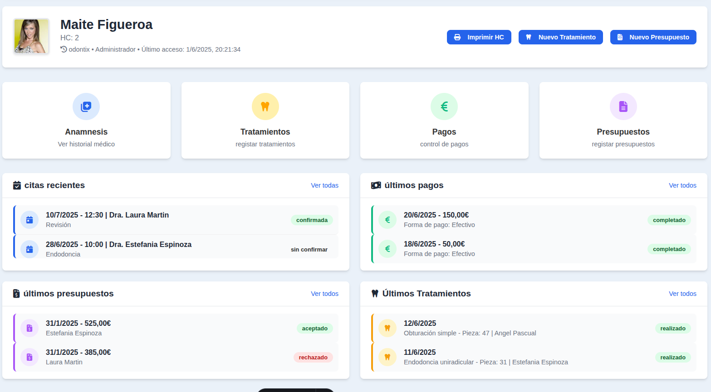
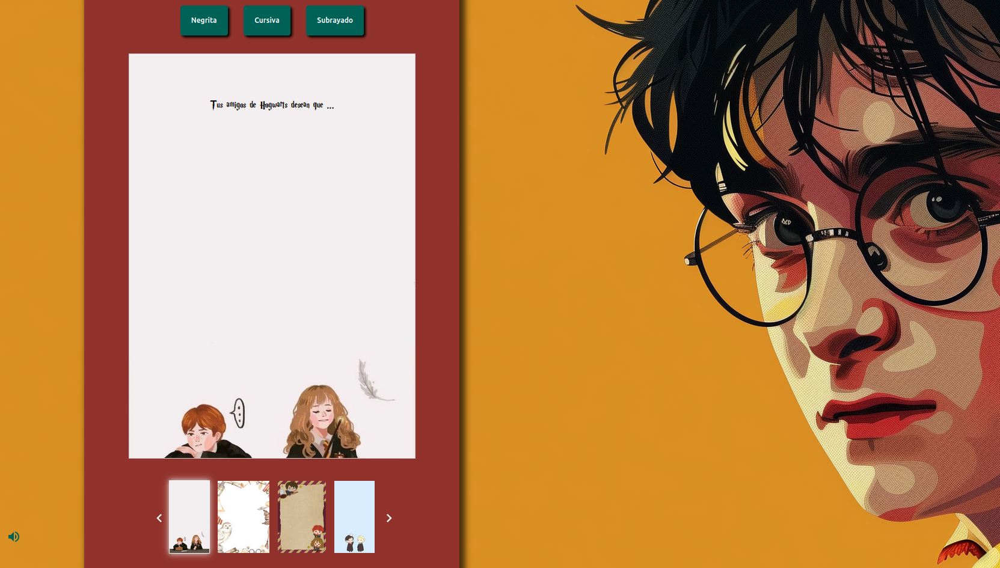
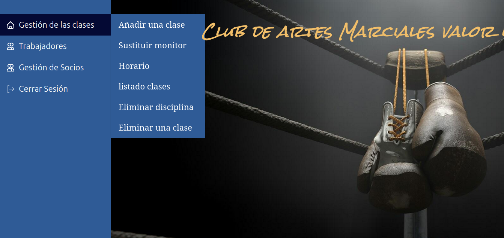

# Bienvenid@ a mi pérfil, mi nombre es Alicia 👋
### Desarrolladora de aplicaciones web 

Siempre había sentido mucha curiosidad por el mundo de la programación, y finalmente me aventuré a dar este giro profesional, en el cuál tengo muchas ganas de aprender y de evolucionar.
En este perfil puedes encontrar mis porfolio con mis proyectos personales, y también ejercicios de lógica utilizando diferentes tecnologías.

🇬🇧 I have an intermediate level of English, I practice English daily! I watch series and movies, I read English books and practice speaking with another person.

 # Tecnologías 

### Frontend

 

 

 

### Backend  

 

 

### Bases de Datos

### Despliegue de aplicaciones

 

 

 

### Autentificación

 

 

### Sistemas Operativos 

 

# APLICACIONES DESTACADAS! 🚀

## Software de gestión para clinicas dentales 🦷

#### Descripción de la funcionalidad

OdontixCloud es un software dental en desarrollo, cuyo objetivo es convertirse en una solución comercial una vez que su implementación esté completamente finalizada.
 
Actualmente, representa mi proyecto personal más destacado, en el cual he abordado diversas carencias que he detectado en otros programas de la competencia.
 
El principal propósito de OdontixCloud es minimizar el tiempo de uso por parte del personal sanitario, es decir, optimizar al máximo su eficiencia. 
 
Para alcanzar esta meta, el diseño del sistema se ha basado en las necesidades clínicas más habituales y en garantizar un acceso inmediato a la información relevante que el equipo sanitario pueda necesitar durante su jornada.
 
Por ejemplo, resulta fundamental que desde la propia agenda se pueda acceder de forma directa a la historia clínica del paciente que se está atendiendo, visualizar alertas sobre patologías, alergias o medicación, e incluso registrar pagos, todo desde una misma interfaz ágil y funcional.
 
#### 💻 Tecnologías Utilizadas

|      Capa      |              Tecnologías                    |
|----------------|---------------------------------------------|
| Backend        |  🟥 Java  🟩 Spring Boot  ⬜ Hibernate      |
| Frontend       |  🟦  TypeScript CSS                         |
| Base de datos  |  🟧  MySQL 🐬                               |

 

📽️ **Demo en vídeo de OdontixCloud** (click en la imágen para acceder a la demo):

El código fuente de OdontixCloud no es público y sólo está disponible previa solicitud por parte de empresas interesadas en contar con mi colaboración en su equipo de desarrollo.

  

## Procesador de textos Harry Potter 🧙‍♂️✨

**Nueva funcionalidad para la página web de la tienda especializada en productos de Harry Potter**

Con el objetivo de mejorar la experiencia de compra y ofrecer un valor añadido a nuestros clientes, se implementará una nueva funcionalidad que permitirá a los usuarios personalizar cartas para acompañar los regalos adquiridos en la tienda.

#### Descripción de la funcionalidad

Cuando un cliente realiza la compra de un producto, tendrá la opción de redactar una carta personalizada dirigida a la persona destinataria del regalo. Esta carta estará inspirada en la temática de la saga Harry Potter, aportando un toque mágico y especial acorde con el universo de la tienda.

#### 🎨 Opciones de personalización

- **Selección de fondo:** El cliente podrá elegir entre una amplia variedad de fondos con motivos de Harry Potter para decorar la carta, permitiendo que la presentación sea única y atractiva.

- **Estilos de texto:** Para dar mayor libertad creativa, la carta podrá ser editada con tres estilos tipográficos diferentes: **negrita**, *cursiva* y <u>subrayado</u>.  
  Esto facilitará destacar las partes más importantes del mensaje y personalizar el diseño del texto.

#### 💾 Guardado y edición progresiva

El cliente podrá guardar la carta en el navegador en cualquier momento mediante almacenamiento local (`localStorage`), permitiendo continuar con la edición cuando desee, sin perder el contenido previamente escrito. Esto facilita la escritura creativa y asegura que la carta quede completa y perfecta antes de la descarga final.

#### 📥 Descarga y formatos disponibles

Una vez que la carta esté finalizada, el cliente tendrá la opción de descargarla en dos formatos:

1. **Formato PDF:** Para una presentación formal y adecuada para impresión o envío digital.

2. **Formato texto plano:** Para facilitar la edición colaborativa desde otros dispositivos. Este formato permitirá que otras personas puedan añadir contenido o modificar la carta desde diferentes ordenadores antes de generar la versión final en PDF.

#### 💻 Tecnologías Utilizadas
🟨 JavaScript  🟦 CSS

#### 🌐 Acceso al Procesador de Texto Harry Potter

- [🔗 **Visita la aplicación web procesador de textos de Harry Potter**](https://cheshire394.github.io/procesadorTexto.github.io/)

- [📂 **Código fuente del procesador de textos de Harry Potter en GitHub**](https://github.com/cheshire394/procesadorTexto.github.io)

---
## Gimnasio de Artes Marciales 🥋💥

Esta aplicación web está diseñada para optimizar la administración de tu gimnasio, usando MySQL, PHP, y poquito de JavaScript y CSS. Con ella, podrás gestionar fácilmente tanto a tus socios como a las clases y monitores. 

#### Descripción de la funcionalidad

   👥 Gestión de Socios: Agrega, elimina y modifica los datos de tus socios rápidamente.
    
   🥊 Clases y Tarifas: Los socios pueden apuntarse o desapuntarse de las clases de acuerdo con sus tarifas, con limitaciones automáticas. ¡No tendrás que preocuparte de que los socios asistan a clases que no forman parte de su tarifa!
    
   🥋 Administración de Clases: Añade nuevas clases, elimina las que ya no quieras impartir y elimina una disciplinas cuando consideres necesario.
    
    Gestión de Monitores: Los monitores no se pueden modificar ni añadir/eliminar, pero sus condiciones de horarios y salarios se ajustan automáticamente al modificar las clases que imparten. 
  

#### 💻 Tecnologías utilizadas:

|     Capa     |       Tecnología        |
|--------------|-------------------------|
| Backend      |         🟪 PHP          |
| Base de datos|       🐬🟧 MySQL        |
| Frontend     |  🟨 JavaScript  🟦 CSS  |

#### 🌐 Acceso a la aplicación

- [🔗 **Visita la aplicación web gimnasio de Artes Marciales**](http://gimnasioproyectophp.infinityfreeapp.com/proyecto_gym_MVC/view/index.php)

- [📂 **Código fuente gimnasio de Artes Marciales en GitHub**](https://github.com/cheshire394/proyecto_gym_MVC)

## Contacto

enlaces de contácto: 
  
- **Correo Electrónico**: [alicia.dsc94@gmail.com](mailto:alicia.dsc94@gmail.com)
- **Teléfono**: [+34 650 44 82 57](tel:+34650448257)
  

  

